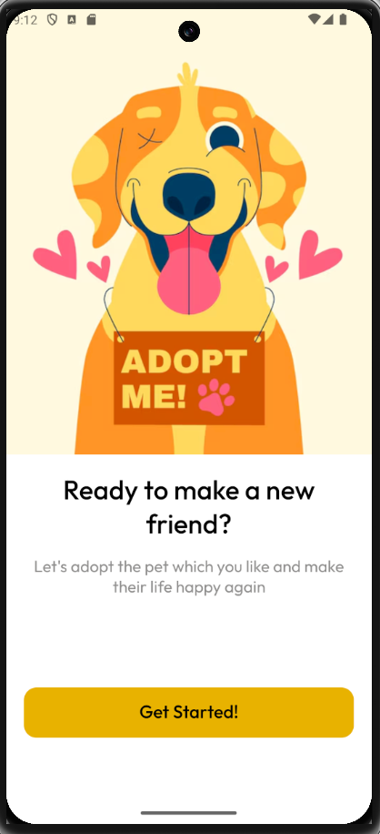
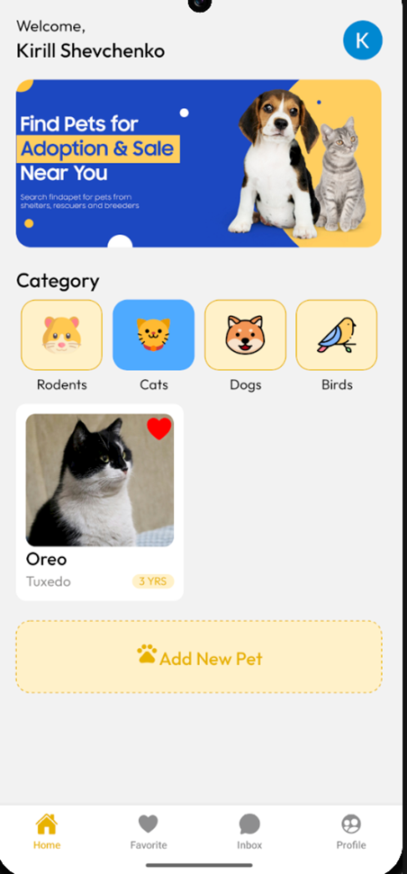
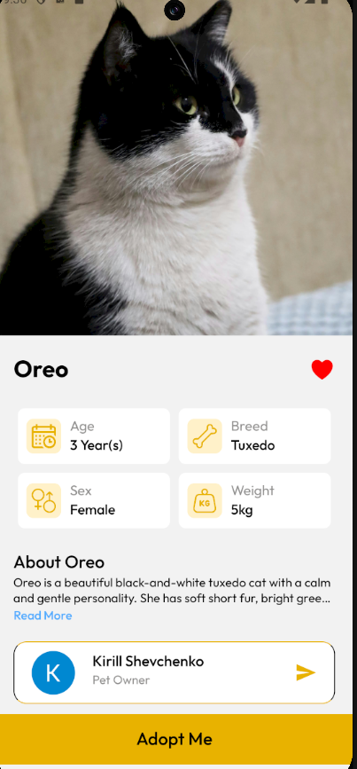
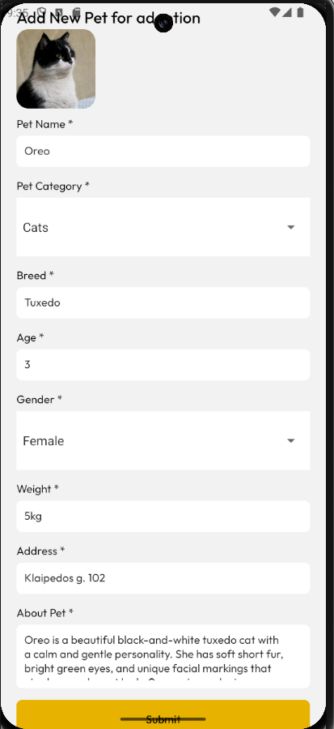
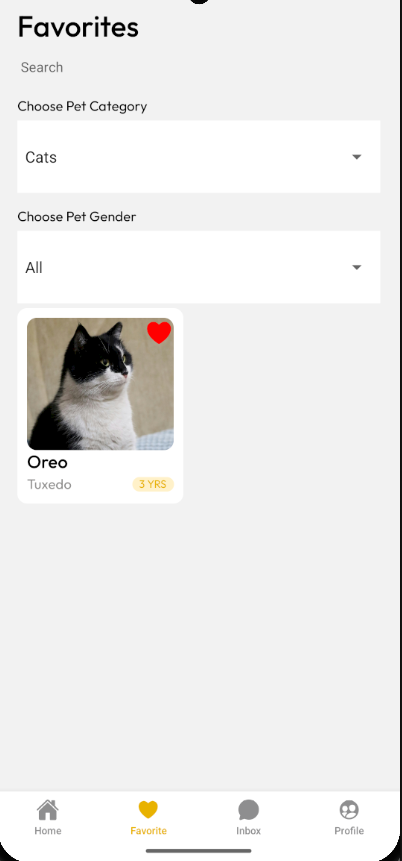
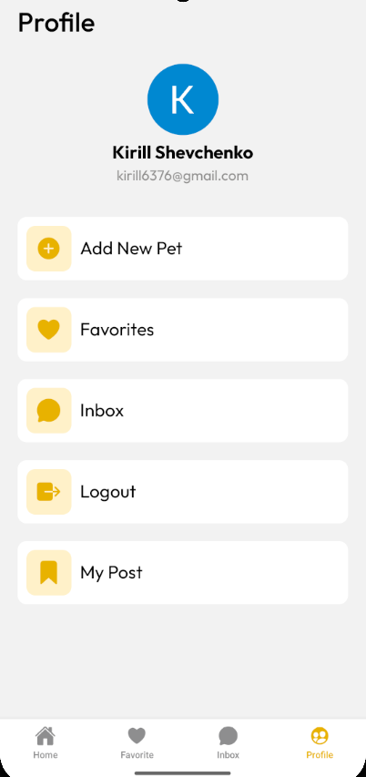
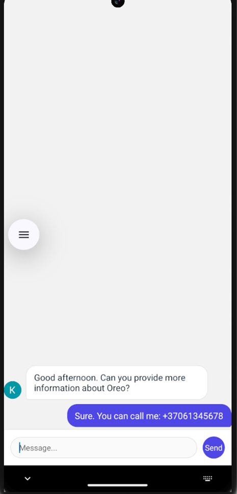

# 🐾 Pet-Adopt-App
Mobile pet adoption app built with React Native (Expo). The app allows users to browse and filter pets, view details, list animals for adoption, manage favorites, and chat with pet owners in real time.

---

## 📱 Features

* **User Authentication**: Secure and fast login via Google powered by **Clerk Expo**.
* **Browse & Filter**: Explore various pet categories and filter them by category and gender.
* **Pet Management**: Users can list new pets for adoption with rich details (name, breed, age, gender, weight, address, and description).
* **Cloud Media Storage**: High-performance image uploads and hosting integrated with **Cloudinary API**.
* **Custom Real-Time Chat**: A fully custom-built messaging system created using pure JavaScript, React Native components, and Firebase Firestore listeners for instant messaging.
* **Favorites System**: Save favorite pets to a dedicated list for quick access.

---

## 📸 Screenshots

To give a better look at the user experience, here are some screens from the application:

| Welcome Screen | Home / Dashboard |
| :---: | :---: |
|  |  |

| Pet Details | Add New Pet Form |
| :---: | :---: |
|  |  |

| Favorites Filter | User Profile | Inbox |
| :---: | :---: |
|  |  | 

---

## 🛠 Tech Stack

* **Language:** JavaScript (React / React Native)
* **Framework:** React Native (Expo SDK 54) with **Expo Router** (File-based routing)
* **Authentication:** Clerk Expo (Google OAuth)
* **Database & Real-time:** Firebase Firestore (Handles core data & custom real-time chat sync)
* **Media Cloud:** Cloudinary API (Image hosting)
* **UI & Styling:** Pure React Native StyleSheet & Flexbox (Custom UI layout), Expo Vector Icons
* **Media & Assets:** Expo Image & Expo Image Picker

---

## 🚀 Getting Started

Follow these steps to set up the project locally:

### Prerequisites

Before you begin, ensure you have **Node.js** installed on your machine.

### Installation

1. **Clone the repository:**
   ```bash
   git clone [https://github.com/Shirirudesu/Pet-Adopt-App.git](https://github.com/Shirirudesu/Pet-Adopt-App.git)
   cd Pet-Adopt-App

2. **Install dependencies:** 
   npm install

3. **Set up Environment Variables:**
   Create a .env file in the root directory of the project and populate it with your Firebase and Clerk credentials:
   EXPO_PUBLIC_CLERK_PUBLISHABLE_KEY=your_clerk_publishable_key
   EXPO_PUBLIC_FIREBASE_API_KEY=your_firebase_api_key
   EXPO_PUBLIC_FIREBASE_AUTH_DOMAIN=your_firebase_auth_domain
   EXPO_PUBLIC_FIREBASE_PROJECT_ID=your_firebase_project_id
   EXPO_PUBLIC_FIREBASE_STORAGE_BUCKET=your_firebase_storage_bucket
   EXPO_PUBLIC_FIREBASE_MESSAGING_SENDER_ID=your_firebase_messaging_sender_id
   EXPO_PUBLIC_FIREBASE_APP_ID=your_firebase_app_id

4. **Start the application:**
   npx expo start

---

## 📱 How to Run

Once the Expo server is up and running, you can open the app using one of the following methods:

* **On Mobile (Expo Go):** Download the **Expo Go** app from the App Store or Google Play Store. Open it and scan the QR code displayed in your terminal.
* **On Emulator:** Press `a` for Android Emulator or `i` for iOS Simulator directly in the terminal after starting the packager.

